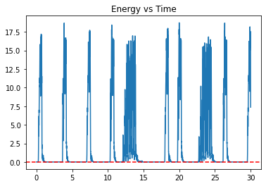
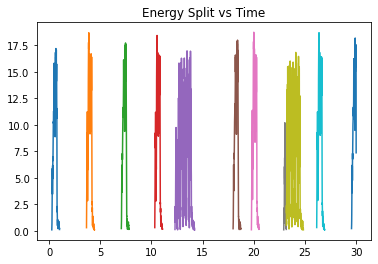
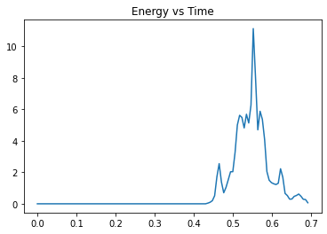
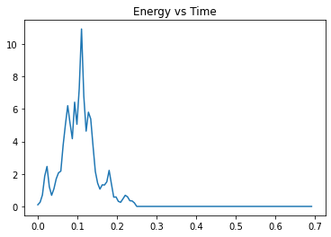
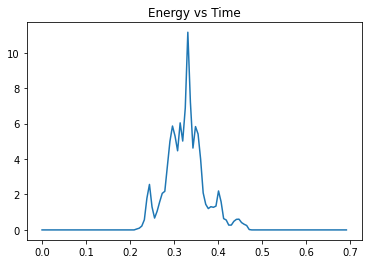
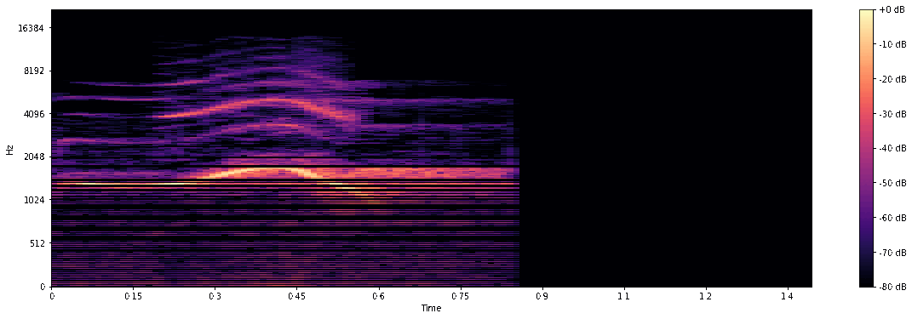
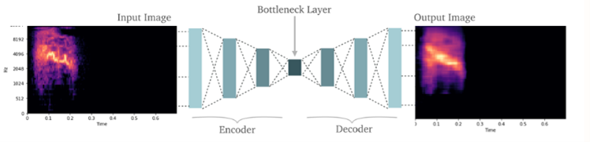
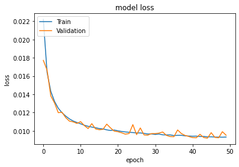
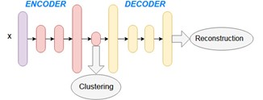
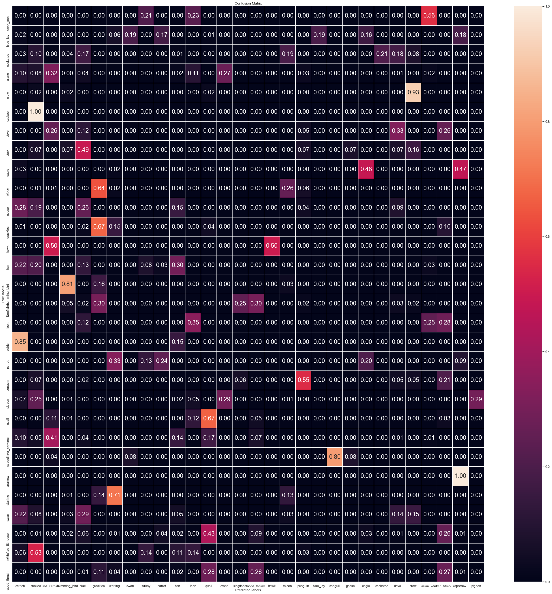

# Automated recognition of bird sounds 

The goal of this project is to automatically segment birds according to their species and find the number of calls in recordings. This helps to increase efficiency of bird experts as they can listen to the portions with bird activity instead of listening to the entire recording to identify the birds. 

## Data
The dataset contains 10-minute recordings of 30 species of birds. The recordings are clean and every recording only contains calls from one bird.
| Asian Koel | Cuckoo | Goose | Kingfisher | Pigeon | Starling |
| :---: | :---: | :---: | :---: | :---: | :---: |
| Blue Jay | Dove | Grackles | Loon | Quail | Swan |
| Cockatoo | Duck | Hawk | Ostrich | Red Cardinal | Tufted Titmouse |
| Crane | Eagle | Hen | Parrot | Seagull | Turkey |
| Crow | Falcon | Hummingbird | Penguin | Sparrow | Wood thrush |

## Data Processing
1) Calculate Energy 
- Given a recording, we are only interested in portions where there is a bird call. 
- The recordings are sampled at 44.1 KHz and only one channel is used for processing. 
- Energy was calculated for all 30 recordings. A rise in energy signifies the presence of birds.

    

2) Separate Bird Calls 
- Identify bird calls and separate them 

    

3) Padding Audio 
- Call length of the birds vary causing the duration of the audio clips to be different.
- However, the duration of the audio of clips needs to be the same before feeding data into the Convolutional Autoencoder.
- The recordings in the training set were padded in three different ways – before a call, after a call, before and after a call.
- This was to train the model to detect a call regardless of the placement of the call. The increased number of recordings in the training set also creates a robust model. 
- However, the audio clips in the testing and validation set were only padded after the call. 

    | Padded Before | Padded After | Padded Before & After | 
    | :---: | :---: | :---: | 
    |  |  |  | 

4) Save audio files
- Save audio files for train, test and validation in separate folders as npy files 

## Convolutional Autoencoder (CAE)
1) Generate Spectrograms
- A spectrogram, visual representation of frequencies over time, is generated for every audio file.
- The spectrogram was represented in the Mel scale as it matches more closely to what humans hear 

    

 2) CAE Framework
 - Since the spectrogram is a 2-D array the CAE was chosen to automatically select the features.  The CAE was used to compress and reconstruct the spectrogram. 
 - The input spectrogram size was 64 x 120. The encoder and decoder contained four hidden layers each. 
 - At the bottleneck layer, the spectrogram size was 4 x 5. 

    

### Training 
3) Training the Model 
- The network was trained for 50 epochs with the Adaptive Moment Estimation (ADAM) optimiser and Mean Squared Error (MSE) loss function. 
- Both the training and validation loss decreased slowly after 50 epochs as it did not improve the clustering or classification results significantly.
    
    

### Clustering  
4) Unsupervised Learning – Bird Clustering 
- The bottleneck layer and clustered the compressed features to observe if we can segment the birds according to the species accurately as shown in the figure below. 
- The compressed features from the test set were clustered using Hierarchial Clustering. Euclidean Distance was used to compute the linkage. 

    

### Evalution 
5) Evaluate Model 
- The clustering process was evaluated using Confusion Matrix 
- However, the problem was that the clustering algorithm assigned an arbitrary label to every cluster it formed. These labels changed every time the clustering algorithm ran.
- The Hungarian algorithm was used figure out the best configuration that would yield minimal cost.

    
